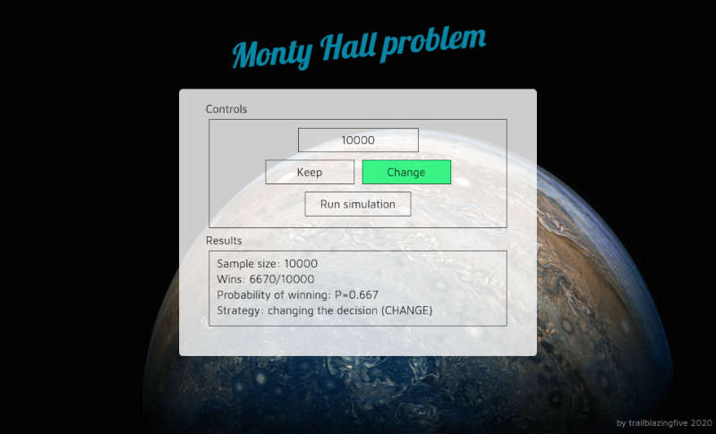

<h2 align="center">
  Monty Hall problem
</h2>

The Monty Hall problem is a brain teaser, in the form of a probability puzzle, loosely based on the American television game show Let's Make a Deal and named after its original host, Monty Hall [(learn more)](https://en.m.wikipedia.org/wiki/Monty_Hall_problem).

<p align="center">
  
</p>

## Setup

Clone the repository and run `npm run install`.

## Development
* `Terminal #1` - run React frontend `npm run start` => [`localhost:3000`](http://localhost:3000)
* `Terminal #2` - run express backend `npm run server` => [`localhost:3100`](http://localhost:3100)

## Production
Run `npm run monty-app` builds the React frontend and serves it via express using static middleware at [`localhost:3100`](http://localhost:3100).

## Backend API
The [express](https://expressjs.com/) backend responds to POST request at [`localhost:3100/api/monty`](http://localhost:3100/api/monty).
### Request body
```
{
  "sampleSize":<Integer>,
  "keep":<Boolean>,
  "numberOfDoors":<Integer>
}
```
### Response body
```
{
  "sampleSize": <Integer>,
  "wins": <Integer>,
  "keep": <Boolean>,
  "numberOfDoors": <Integer>,
  "winRate": <Float>
}
```
While in production the build React app is served from the same port as the backend; in order to cancel this feature it run `rm -rf build` in app root folder.